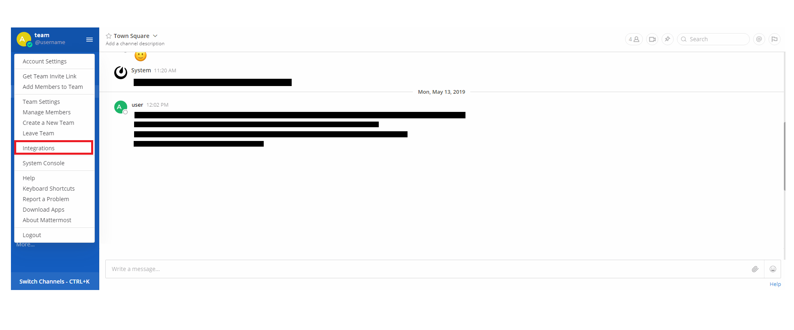
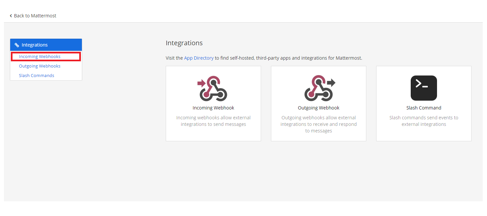
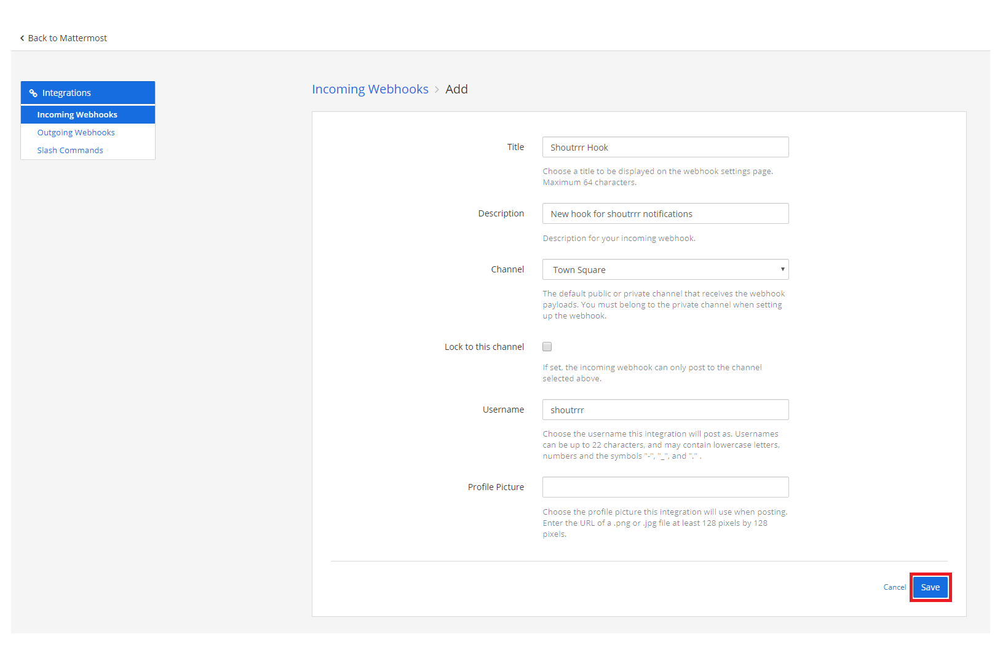

# MatterMost

## URL format

## Creating a Webhook in MatterMost

1. Open up the Integrations page by clicking on *Integrations* within the menu


2. Click *Incoming Webhooks*


3. Click *Add Incoming Webhook*


4. Fill in the information for the webhook and click *Save*


5. If you did everything correctly, MatterMost will give you the *URL* to your newly created webhook


6. Format the service URL
```
https://your-domain.com/hooks/bywsw8zt5jgpte3nm65qjiru6h
                              └────────────────────────┘
                                        token
mattermost://your-domain.com/bywsw8zt5jgpte3nm65qjiru6h
                             └────────────────────────┘
                                       token
```

## Additional URL configuration

Mattermost provides functionality to post as another user or to another channel, compared to the webhook configuration.
<br/>
To do this, you can add a *user* and/or *channel* to the service URL.

```
mattermost://shoutrrrUser@your-domain.com/bywsw8zt5jgpte3nm65qjiru6h/shoutrrrChannel
             └──────────┘                 └────────────────────────┘ └─────────────┘
                 user                               token                channel
```

## Passing parameters via code

If you want to, you also have the possibility to pass parameters to the `send` function.
<br/>
The following example contains all parameters that are currently supported.

```gotemplate
params := (*types.Params)(
	&map[string]string{
		"username": "overwriteUserName",
		"channel": "overwriteChannel",
	},
)

service.Send("this is a message", params)
```

This will overwrite any options, that you passed via URL.